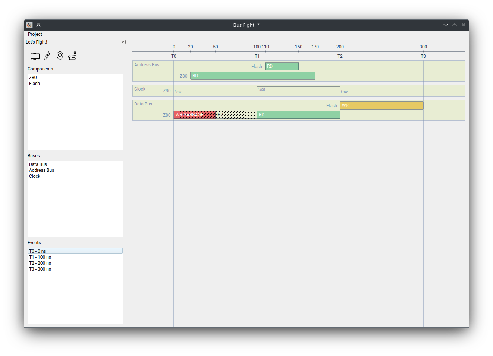

# BusFight

BusFight is a simple Linux utilty program to visualize how devices are reading and writing signals on a bus.

## Compilation

BusFight is currently built with *Qt6*. It needs the `Widgets` and the `Svg` development headers to compile. You can look at `.github/workflows/compilation.yml` for detailed info.

If all dependencies are installed it should be easy to compile:
```
mkdir build
cd build
cmake ../
make
```

## Usage

You have **components**, **buses**, **events** and **sections** to work with.

- Add a component
- Add a bus
- A few events
- Start adding sections, chosing the component, the bus, and the time references using events.


